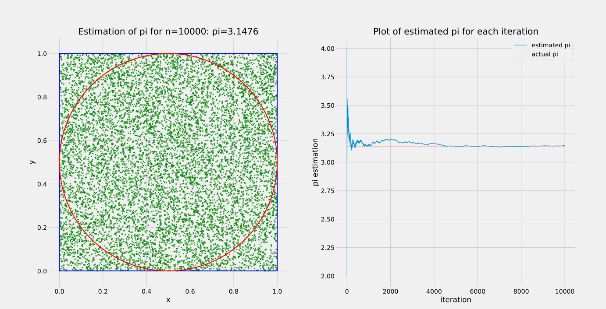

## pi-monte-carlo: Estimate &#960; using the Monte Carlo Method

<p align="center">
  
  <br></br>
  <b>Estimation of pi with a sample size of n=10000</b>
</p>

## Getting Started
### Dependencies ###

- [Cython](https://cython.org/) is used for calculations to increase performance
- Random points are generated using [Numpy](https://numpy.org/) 
- Graphs are plotted using [Matplotlib](https://matplotlib.org/)

### Preperations ###
1. Clone the repository
```bash
git clone https://github.com/emrecil/pi-monte-carlo
cd pi-monte-carlo
```


2. Install requirements
```bash
pip install -r requirements.txt
```


3. Build Cython file
```bash
python setup.py build_ext --inplace
```

## Usage

To start the program run the following command
```bash
python monte_carlo_pi.py
```

By default 1000 random points will be generated. You can specify a custom sample size as an argument:
```bash
python monte_carlo_pi.py [sample size]
```

## How it works
First we draw a unit square which has an Area of . Then we draw a circle inside this square with a radius of 0.5. The area of this circle is 
.

Now we create n random points inside the square. With the ratio of the number of points inside the circle to the total number of points an approximation of &#960; can be computed since:


and thus

.
